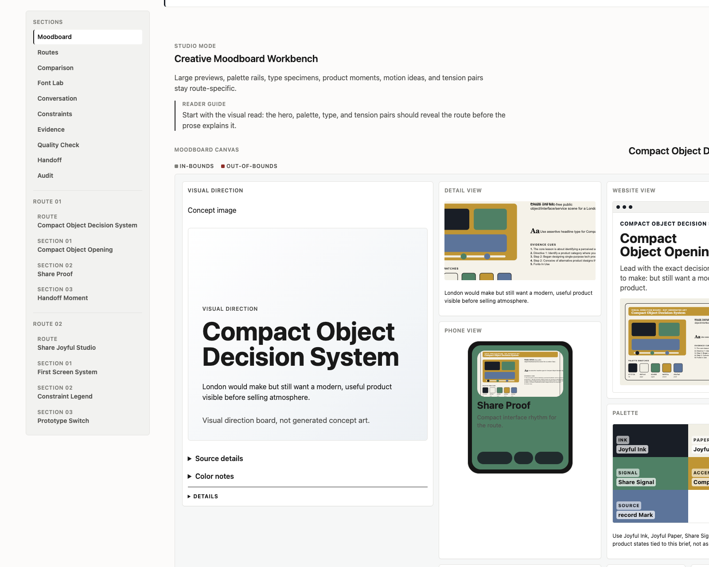
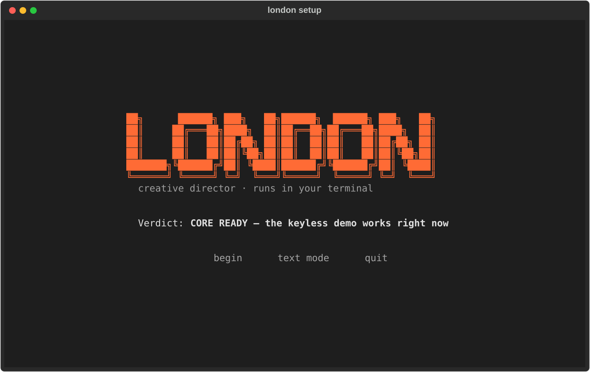

<picture>
  <source media="(prefers-color-scheme: light)" srcset=".github/assets/wordmark-light.svg">
  
</picture>

<p align="center">
  <a href="https://github.com/tom-nwachuku/london-design/actions"></a>
  
  
  
</p>

<p align="center"></p>

<p align="center"><sub>one line in → research, two competing visual routes, type &amp; color with receipts, a build handoff</sub></p>

## What he gives you back



Give London one line and he returns a complete creative direction: research with receipts, a reframe of what you actually asked for, two competing visual routes, typography and color with rationale, a moodboard, image prompts or generated images, an independent audit of his own run, and two handoff documents your designer and your builder can pick up without a meeting.

It arrives as a self-contained HTML dossier. No server, no build step, no remote assets. The folder is the deliverable.

## Try it in 60 seconds

```bash
uv tool install git+https://github.com/tom-nwachuku/london-design
london setup
london examples/brief.md --offline --out my-pack
```

Then open `my-pack/index.html`.

`london setup` is a guided installer — it shows you what your machine can do and walks you through anything missing:



The `--offline` run is a labeled deterministic demo: the full dossier shape, without the model's thinking. No API key is needed for anything above.

```console
$ london "a banking app my grandmother wouldn't be scared of"
```

## The engine

London runs inside a model. The model does the creative thinking; everything else is honest plumbing around it.

| Mode | When | Needs |
|---|---|---|
| **In-session** | You're inside Claude Code — London detects it | Nothing. No key. |
| **API key** | Standalone terminal | `ANTHROPIC_API_KEY` |
| **Offline** | Demo, CI, no model available | Nothing — clearly labeled deterministic sample |

If no model is reachable, London says so and stops. He never quietly degrades to canned output pretending to be taste.

```console
$ london "rebrand a funeral home for millennials"
```

## He can't grade his own homework

Every run ships with an independent audit: five inspectors checking London's *claims* against the run's *actual telemetry*.

- **Source Auditor** — every cited source verified against what was really consulted; unverifiable citations get flagged, not hidden
- **Grounding Inspector** — how deeply he actually queried his design brain
- **Distinctness Referee** — are the routes genuinely different (perceptual color distance, not vibes)
- **Output Manifest** — required regions at honest cardinality, no padding
- **Type Selection Referee** — the font lab offers real range, not three safe defaults

When telemetry isn't available, the grader says **n/a**. A score you can't trust is worse than no score.

```console
$ london "packaging for hot sauce sold in pharmacies"
```

## Briefs to steal

| Brief | The tension |
|---|---|
| `london "a coffee brand for night-shift nurses"` | care-giving audience, anti-cozy hours |
| `london "a banking app my grandmother wouldn't be scared of"` | trust vs. fintech aesthetics |
| `london "rebrand a funeral home for millennials"` | tone tightrope |
| `london "packaging for hot sauce sold in pharmacies"` | context collision |
| `london "a dating app for people who hate dating apps"` | the paradox brief |
| `london "a meditation app for people with ADHD"` | the audience that can't sit still |
| `london "a portfolio site for an architect who only builds treehouses"` | whimsy meets craft |

Write your own: give him an audience and a tension.

## The honest parts

- The offline demo is deterministic and says so on every surface. The model paths are where the taste lives.
- Image generation is optional. Metered lanes refuse to run without `image.allow_paid=true` and a spend limit; the OpenAI default is 4K (~$0.25/image) and `london setup` tells you so before you spend anything.
- This is a v0.1. Rough edges exist. When you hit one, file the hesitation — the word that confused you, the screen that stalled you. That's the most useful issue you can write.

## Four ways in

1. **Run briefs, file hesitations.** Use it, note every pause, open an issue per pause.
2. **Judge his taste.** Designers: critique a route, a moodboard, a type pairing in an issue. Output-quality reviews are first-class contributions here.
3. **Pick up an issue.** Python 3.11+, typer, no framework magic. The test suite is the documentation.
4. **Own a provider lane.** ComfyUI workflows, Automatic1111 presets, local model configs — each lane is self-contained.

---

MIT. London Osei is a fictional persona. The creative reasoning is the model's; everything else is honest plumbing.
